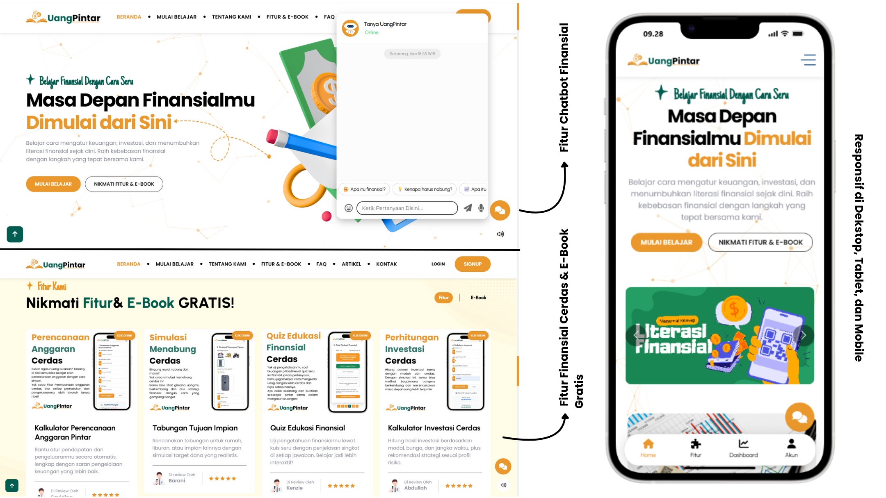

# Nama Pencipta: blm di atur
##  Nama Tim : Skinfa Developers
 Judul Project: Website Edukasi Sampah Bijak “Sampah Bijak”
 Tema: Edukasi Sampah Bijak untuk Remaja dan Dewasa | “Innovation Beyond Limits: Empowering the Future with IT”

## 💡 Latar Belakang

Di era modern saat ini, masih banyak remaja dan dewasa muda yang belum memahami cara mengelola keuangan dengan baik. Banyak dari mereka belum mengenal konsep dasar seperti perencanaan anggaran, menabung, investasi, maupun manajemen pengeluaran. Akibatnya, muncul berbagai masalah Sampah Bijak di usia muda seperti boros, terlilit hutang, atau tidak punya tabungan jangka panjang.

Melihat hal tersebut, saya terinspirasi untuk membuat website edukasi Sampah Bijak yang menarik, interaktif, dan mudah dipahami, agar generasi muda bisa belajar mengatur keuangan secara cerdas sejak dini.

## ⚠️ Permasalahan

- Kurangnya pengetahuan remaja tentang manajemen keuangan pribadi.
- Minimnya platform edukasi Sampah Bijak yang dikemas secara menarik dan interaktif.
- Sulitnya menemukan alat bantu praktis untuk menghitung anggaran, investasi, dan tabungan.

## 🚀 Solusi

Website Sampah Bijak hadir sebagai solusi digital edukatif yang membantu pengguna memahami konsep Sampah Bijak secara menyenangkan.
Dengan desain yang sangat menarik, responsif, dan berfokus pada kesempurnaan UI/UX, website ini mempunyai tampilan yang mudah dipahami, profesional, dan nyaman digunakan di semua perangkat.
Setiap elemen dirancang dengan interaksi yang halus, layout modern, serta performa yang ringan, sehingga pengguna dapat belajar, menghitung, dan merencanakan keuangan mereka secara mandiri dengan pengalaman terbaik.

## 🎯 Tujuan

- Meningkatkan literasi Sampah Bijak di kalangan remaja dan dewasa.
- Menyediakan platform belajar keuangan digital yang seru dan mudah dipahami.
- Membantu pengguna dalam mengelola uang, menabung, dan berinvestasi dengan bijak.
- Mendorong generasi muda agar lebih siap menghadapi tantangan Sampah Bijak masa depan.

## 🧠 Fitur Unggulan

- 💰 Kalkulator Perencanaan Anggaran Pintar – membantu pengguna menghitung rencana keuangan bulanan.
- 🎯 Tabungan Tujuan – fitur menabung berdasarkan target yang ingin dicapai.
- 🧩 Quiz Edukasi Sampah Bijak – belajar sambil bermain agar tidak membosankan.
- 📈 Kalkulator Investasi – simulasi hasil investasi untuk berbagai jangka waktu.
- 🤖 Chatbot Tanya Sampah Bijak – asisten virtual yang menjawab pertanyaan seputar keuangan dan memberi tips bermanfaat.
- 📊 Dashboard – menampilkan hasil, progress, dan laporan keuangan pengguna dengan desain modern.
- 📚 Ebook Gratis – sumber belajar tambahan untuk mendukung peningkatan literasi Sampah Bijak.

## 💻 Teknologi yang Digunakan

- HTML5 – untuk struktur halaman web

- CSS3 – untuk tampilan dan desain

- JavaScript – untuk logika interaktif dan fitur 

- Bootstrap – untuk desain responsif dan komponen modern

## 📂 Struktur Project
```
SYAFIQBAMAZRUK_ITFEST.UHO_WEBDESIGN/
│
├── assets/
│   ├── css/              # Berisi file stylesheet (tampilan dan desain)
│   ├── js/               # Berisi file JavaScript (logika dan interaktivitas)
│   └── media/            # Berisi gambar, ikon, dan aset multimedia lainnya
│
├── DASHBOARD/
│   └── index.html        # Halaman dashboard interaktif pengguna
│
├── _DOKUMENTASI.png      # Gambar dokumentasi proyek
├── .htaccess             # Pengaturan URL rewrite agar link lebih rapi
│
├── about.html            # Halaman tentang website
├── artikel-1.html        # Artikel 1
├── artikel-2.html        # Artikel 2
├── artikel-3.html        # Artikel 3
│
├── belajarsampahbijak.html # Halaman pembelajaran Sampah Bijak
│
├── ebook-1.html          # Ebook literasi Sampah Bijak 1
├── ebook-2.html          # Ebook literasi Sampah Bijak 2
├── ebook-3.html          # Ebook literasi Sampah Bijak 3
├── ebook-4.html          # Ebook literasi Sampah Bijak 4
│
├── faq.html              # Halaman Pertanyaan Populer
│
├── fitur-detail-1.html   # Detail fitur: Kalkulator Anggaran
├── fitur-detail-2.html   # Detail fitur: Tabungan Tujuan
├── fitur-detail-3.html   # Detail fitur: Quiz Edukasi
├── fitur-detail-4.html   # Detail fitur: kalkulator Investasi
│
├── index.html            # Halaman utama website Include Chatbot
├── kontak.html           # Halaman kontak 
├── login.html            # Halaman login pengguna
├── register.html         # Halaman pendaftaran pengguna
│
└── README.md             # Dokumentasi proyek
```
## Website tersedia (Aktif) :
https://SampahBijak.netlify.app

## Dokumentasi Proyek : 

