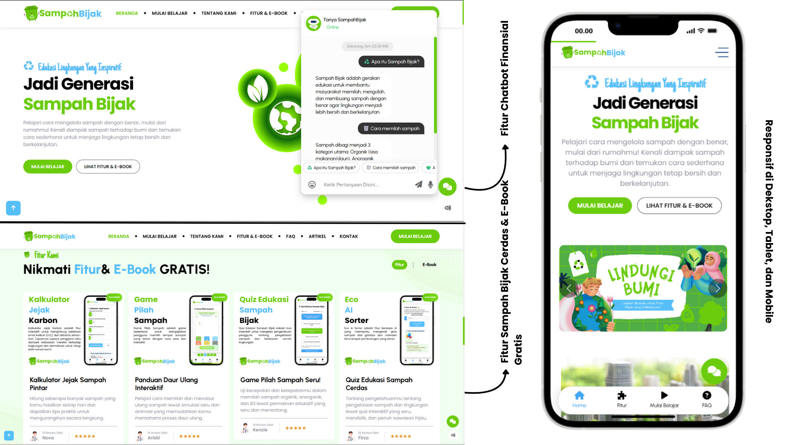

#  Nama Tim : Skinfa Developers
## Nama Anggota : 1. Syafiq Bamazruk 2. Sayidina Aqilah Barani Yusup

 Judul Project: Website Edukasi Sampah Bijak “Sampah Bijak”
 Tema: Edukasi Sampah Bijak untuk Semua Kalangan | ““Eco Digital For Environment: Web Design Competition”

## 💡 Latar Belakang

Di era modern saat ini, masalah sampah menjadi salah satu tantangan terbesar bagi lingkungan. Banyak remaja dan masyarakat umum yang masih belum paham cara memilah sampah, jenis sampah yang benar, dampak sampah terhadap bumi, serta bagaimana menerapkan prinsip 3R (Reduce, Reuse, Recycle) dalam kehidupan sehari-hari.

Melihat kondisi tersebut, saya terinspirasi untuk membuat website edukasi Sampah Bijak yang menarik, interaktif, dan mudah dipahami. Website ini dirancang agar generasi muda dan masyarakat umum bisa belajar mengelola sampah dengan cara yang benar, praktis, dan menyenangkan agar mereka lebih peduli dan bertanggung jawab terhadap lingkungan.

## ⚠️ Permasalahan

- Kurangnya pemahaman masyarakat mengenai cara memilah sampah organik dan anorganik.

- Minimnya platform edukasi lingkungan yang dikemas secara interaktif dan mudah dipahami.

- Kurangnya kesadaran untuk menerapkan prinsip 3R dalam aktivitas sehari-hari.

- Masih banyak yang bingung menentukan jenis sampah, dampaknya, dan cara pengolahan yang benar.

## 🚀 Solusi

Website Sampah Bijak hadir sebagai platform edukasi digital mengenai pengelolaan sampah yang ramah lingkungan.
Dengan tampilan yang modern, responsif, dan fokus pada kenyamanan pengguna, website ini memberikan pengalaman belajar yang menyenangkan—baik untuk pelajar, mahasiswa, maupun masyarakat umum.

Setiap fitur dibuat agar edukasi lingkungan terasa ringan, mudah dipahami, dan bisa langsung dipraktikkan dalam kehidupan harian.

## 🎯 Tujuan

- Meningkatkan literasi pengelolaan sampah pada masyarakat, terutama generasi muda.

- Menyediakan media belajar tentang jenis sampah, 3R, dan dampak lingkungan secara interaktif.

- Membantu pengguna memahami cara memilah sampah dengan benar.

- Menumbuhkan kesadaran tentang pentingnya menjaga lingkungan dan mengurangi sampah.

- Mendukung gerakan eco-friendly menuju lingkungan yang bersih dan berkelanjutan.

## 🧠 Fitur Unggulan

- ♻️ Game Pilah Sampah Interaktif – pengguna menggeser sampah ke tong yang benar sambil belajar jenis sampah.

- 🗑️ Kalkulator Jejak Karbon – fitur interaktif untuk menghitung perkiraan emisi karbon (CO2).

- 📘 Quiz Edukasi Sampah Bijak – belajar sambil bermain agar edukasi makin seru.

- 🤖  Eco AI Sorter - Analisis jenis samoah dengan AI Cerdas

- 🤖 Chatbot Eco Assistant – menjawab pertanyaan seputar sampah dan memberikan tips ramah lingkungan.

- 📊 Dashboard Edukasi – menampilkan progress belajar dan skor quiz pengguna.

- 📚 E-Book & Materi Edukasi – materi tambahan tentang cara mengelola sampah dengan benar dan prinsip 3R.

## 💻 Teknologi yang Digunakan

- HTML5 – untuk struktur halaman web

- CSS3 – untuk tampilan dan desain

- JavaScript – untuk logika interaktif dan fitur 

- Bootstrap – untuk desain responsif dan komponen modern

## Website tersedia (Aktif) :
https://SampahBijak.netlify.app

## Dokumentasi Proyek : 

